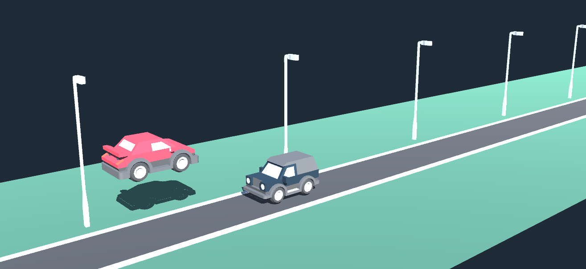

# Refactoring tutorial on ML-Agents 1.0+ in Unity3D
Machine learning to train an agent to jump over obstacles with some analysis and rationale on various design decision. Refactored from public github repo by Sebastian-Schuchmann: https://github.com/Sebastian-Schuchmann/A.I.-Jumping-Cars-ML-Agents-Example

## Rationale
I am the type of person who is always asking why. As such I wanted to use this simple (and excellent) example to explore machine learning and in particular Reinforcement Learning used in Unity's ML Agents. This is from a simple "walkthrough of building an A.I. with Unity’s ML-Agents". See that tutorial first. I will discuss the results, ask many questions, present various issues with even this simple example and show how to refactor this code (and any of the ML Agents code) to be cleaner and have a separation of concerns. I also wanted to upgrade to ML Agents 2.0+.
## Outline
I. Refactoring the code base (can be skipped).
II. Examining the results.
III. Understanding the ML decisions made.
IV. Looking at different simulations, ML parameters, etc.
V. Extensions.

The image above shows the desired goal of this tutorial. The basic (old) framework has / had:
1. A moving background (using an animator) which included the road, the grass and the lightpoles.
   * The street has a tag of Street.
2. A "Player" car model with an input controller that was changed from a Monobehaviour script to an Agent script.
   * The player car does not move.
   * It has a tag of Player.
   * The controller disables jumping while the car is in the air.
   * It uses Rigidbody physics and an impulse to jump.
3. Enemy cars with the tag Mover.
   * All of which had a fixed speed of 20. 
   * A hard-coded offset within the prefab on where to start.
   * A Rigidbody and a BoxCollider.
   * A trigger box slightly behind the car.
4. A trigger at the end of the street that Destroys the moving enemy cars.
5. A Spawner that creates new instances of enemy cars.
6. A Score Display that would show the High Score only. The High score was the maximum number of consecutive cars jumped over. 

The basic behaviour was that the user could hit the space key to jump straight up and gravity would bring the car down. Both the car and the Mover have rigidbodies with a box collider. If the car and a mover collided, the system would destroy all movers (enemies) and basically restart. Scoring would reset if a enemy car was hit as well. If the player hit the trailing trigger box of the enemy (Mover) it would increase the current score by one. If this resulted in a new high score the score display would update.
## Refactoring
### Why
* Separation of concerns: Agent seems to be tied to a specific model / prefab.
* Do not want to trash existing scenes or prefabs.
* Plae all ML logic within a single file with a specific purpose.
* Big believer in using events to remove input and other complexities from player scripts, etc.
### Adding Events
* Obstacle Avoided
* Collision
* JumpRequested
* JumperReset
* HighScore (For ScoreCollector which uses Academy.Instance.StatsRecorder.
### Pulling user interactions out
(See Player.cs)
### Pulling Machine Learning out
(see PlayerML.cs)
### General Clean-up
Positioning prefabs to the origin, changing an OnCollision to an OnTrigger, etc.
### Automatically creating multiple agents and environments.
Once I had everything working and was able to successfully train. I was too lazy to Duplicate the simulation hierarchy and create multiple copies of the agents (not sure this is of much use either). So I made the simulation an environment and then wrote a simple script (CreateTrainingAgents.cs) that would create multiple agents spaced out by some Vector3.
## Results
So now we can use PlayerML with the given events to train jumping. The original poster mentioned that it works quite well. He based this on the score being printed, rather than using the resulting brain (onnx file). Some questions now that we have something working:
1. What does it mean for an AI Agent to "work"? What do we expect in this use case?
   * I would expect the AI to perform with 100% accuracy on this test case.
   * Not sure what to expect if I change any of the "magic numbers" used in the simulation (see below).
2. The car will jump regardless of whether it needs to or not. Is this a desired behavior? How can we avoid this?
   * I put in a small negative reward for jumping which did not seem to work. I also changed and played with the reward values quite a bit. Magic numbers will be addressed later. 
3. How long to train?
4. How many instances to create?
   * With my script I can create 1000's of agents if I want to. Almost all of the tutorials mention this as an optimization. Not sure exactly why (500 FPS vs 20 FPS) and I suspect there is more to this which we will address below. In particular, if all agents have the same behavior and the simulation has no randomness to it, is there a benefit to this?

More to come.
## Analyzing the Process / Choices
### Sebastian's choices
Sebastian made the choice that the only Observation was the distance to the next car. He used a raycast (sphere cast) to find this distance using Unity's built-in Ray Perception Sensor 3D. He used 1 ray with a maximum search distance of 50m. Curiously, the cars spawn about 30m away from the player, so as soon as they spawn there is a distance calculated. He could have made this much shorter. In fact with this simple example there is a maximum distance and a minimum distance to start a jump given only one enemy at a time. Enemies spawn somewhere between 1.5 seconds and 3 seconds apart. At 20 meters per second, they spawn from 30 and 60 meters apart. The jump also takes about 0.5 seconds (I might have changed the physics some on this), so an enemy moves 10 meters during this time. Recall, that the car / player cannot jump until they land (intersect with the street). This suggests that there is plenty of time for each jump and the AI should be able to learn to be perfect. If we increase the jump height / duration and / or increase the enemy speed, then they there is a very tight window to jump between 2 cars spaced 1.5 seconds apart. If the jump actually takes longer or the cars are spawned quicker, then no AI (or human) can accomplish the jumps when we randomly hit this case of closely spaced cars. 
## Magic Numbers
